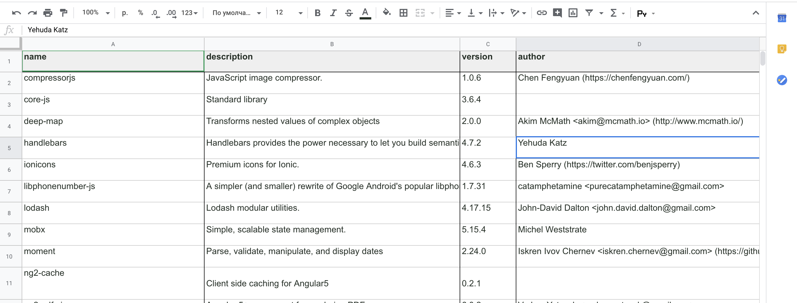

# npm-modules-report

`npm-modules-report` helps you to assemble specific information about npm modules inside your package.json in form of table and export it as xlsx file.

## Installing

Using npm:

```bash
$ npm install npm-modules-report
```

## Example #1

```js
const generateReport = require("npm-modules-report");
const packageFile = require("./package.json");

// it will create npm_report folder with report.xlsx inside
generateReport(
  packageFile, // required
  ["name", "description", "version", "author"] // optional. default ['name', 'description']
).then(output => console.log(output)); // resolves the data that has been exported
```

`report.xlsx` example. You can then edit your file however you like in your favorite xlsx editor



## Example #2 via terminal

```bash
npx build-npm-report
```

or with arguments

```bash
npx build-npm-report name description version
```

Dependencies:

- [xlsx](https://www.npmjs.com/package/xlsx) - Parser and writer for various spreadsheet formats
